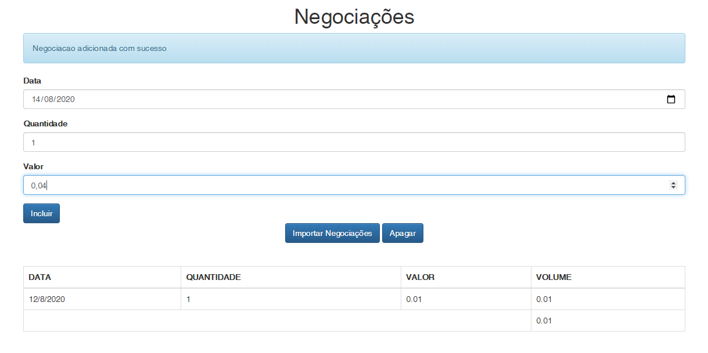

# aluraframe
projeto de negociações realizado durante o curso de javascript avançado da alura

### Padrões de projetos implementados

- [Padrão Observer](https://github.com/leticiacamposs2/aluraframe/tree/padrao-de-projeto-observer)
- [Padrão Proxy e Factory](https://github.com/leticiacamposs2/aluraframe/tree/padrao-de-projeto-proxy-e-factory)